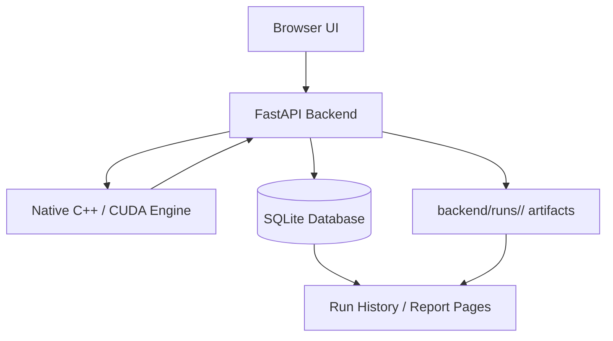

# Silicon Patient Platform

> A biologically credible simulation and drug evaluation platform powered by a C++/CUDA engine, a FastAPI backend, and a modern React dashboard.


## Overview

Silicon Patient Platform is a full-stack research console for evaluating ion-channel pharmacology, running simulation experiments, and reviewing structured results in a persistent run history.

The system is designed as a reproducible workflow:

1. Enter or load a drug profile in the web UI.
2. Submit a simulation or dose-evaluation run. (Internal benchmarking/validation is available to developers.)
3. The backend launches the native engine and captures the output.
4. Parsed results and raw reports are stored for auditability.
5. Run History lets you inspect, filter, and delete individual runs.

## Highlights

- Native C++ engine with optional CUDA acceleration.
- FastAPI service for execution, reporting, and run management.
- React + Vite + Tailwind UI with responsive dashboard pages.
- Persistent SQLite run ledger for audit and traceability.
  - Structured report parsing for dose-response workflows (internal benchmark/validation available to developers).
- Run History actions for viewing reports and deleting a specific run.

## Product Workflow

### 1. Design the experiment

Use the Drug Evaluation page to define the ion-channel profile, dose range, and number of runs. The UI sends the payload to the backend as structured JSON.

### 2. Execute the engine

The FastAPI backend translates the request into an engine invocation. It passes runtime configuration to the native executable, captures stdout/stderr, and measures duration.

### 3. Persist outputs

Each run is stored in two places:

- SQLite database row for searchable history
- Per-run artifact folder under `backend/runs/<run_id>/`

Artifacts include:

- `input.json`
- `report.txt`
- `parsed.json`
- `metadata.json`

### 4. Review results

Open the report detail view or the Run History page to inspect recommendations, risk levels, confidence, and the raw generated report.

### 5. Manage history

Delete a specific run from the Run History page when you want to remove both the database row and the stored artifacts.

## Repository Layout

```text
.
├── analyzer/          # Drug evaluation and reporting logic
├── backend/           # FastAPI service, SQLite storage, engine runner
├── cuda/              # CUDA simulator and kernels
├── drug/              # Drug model definitions
├── frontend/          # React + Vite web application
├── network/           # Network simulation logic
├── neuron/            # Neuron model definitions
├── output/            # CSV output helpers
├── simulation/        # Simulation engine
├── synapse/           # Synapse model logic
└── main.cpp           # Native application entry point
```

## Architecture



## Tech Stack

- C++20 native engine
- CUDA support when available
- FastAPI + SQLAlchemy backend
- SQLite persistence
- React 18 + TypeScript + Vite frontend
- Tailwind CSS, Framer Motion, Lucide icons, Recharts

## Prerequisites

- Windows 10/11 or a compatible development environment
- Python 3.11+
- Node.js 18+
- CMake 3.24+
- A C++ compiler toolchain
- CUDA Toolkit if you want GPU acceleration

## Quick Start

### 1. Build the native engine

From the repository root:

```powershell
cmake -S . -B build-cuda
cmake --build build-cuda --config Release
```

If you are using the provided helper script on Windows, you can also use:

```powershell
.\build_cuda_windows.cmd
```

### 2. Set up the backend

```powershell
cd backend
python -m venv .venv
.\.venv\Scripts\Activate.ps1
pip install -r requirements.txt
```

Create `backend/.env` from `backend/.env.example` and confirm these values if needed:

```env
SPP_ENGINE_PATH=../build-cuda/silicon_patient.exe
SPP_DATABASE_URL=sqlite:///./silicon_patient.db
SPP_ENGINE_TIMEOUT_SECONDS=3600
```

Start the API server:

```powershell
python -m uvicorn app.main:app --host 0.0.0.0 --port 8000 --reload
```

### 3. Set up the frontend

```powershell
cd ..\frontend
npm install
npm run dev
```

Open the app in your browser at:

- http://localhost:5173

## Development Workflow

### Native engine workflow

- Edit the C++ source in `main.cpp`, `analyzer/`, `cuda/`, `drug/`, `network/`, `neuron/`, `simulation/`, `synapse/`, and `output/`.
- Rebuild the executable with CMake.
- The backend consumes the engine binary through `SPP_ENGINE_PATH`.

### Backend workflow

- The backend exposes health, simulation, dose-evaluation, and run-history endpoints. Developer-only internal benchmarking endpoints exist under `/api/internal`.
- Every run is persisted to SQLite and to a matching artifact directory.
- The backend also handles run deletion and report retrieval.

### Frontend workflow

- The React app routes between dashboard, simulation, drug evaluation, and run history pages. The internal benchmark UI is available only in developer mode and is hidden from public navigation.
- The Run History table supports filtering, viewing reports, and deleting one run at a time.
- The UI reads backend state through Axios API helpers in `frontend/src/api/client.ts`.

## API Endpoints

- `GET /health` - service health check
- `POST /api/simulate` - run a single-dose simulation
* `POST /api/internal/validate` - run internal benchmark (developer-only)
- `POST /api/dose-eval` - run dose-evaluation workflow
- `GET /api/runs` - list stored runs
- `GET /api/runs/{run_id}` - fetch run metadata and parsed summary
- `GET /api/runs/{run_id}/report` - fetch the raw report text
- `DELETE /api/runs/{run_id}` - delete one stored run and its artifacts

## Data Storage

### SQLite database

The backend stores run metadata in `backend/silicon_patient.db` by default. The main table is `run_records`.

### Artifact folders

Each run also creates a dedicated artifact directory:

```text
backend/runs/<run_id>/
  input.json
  report.txt
  parsed.json
  metadata.json
```

This makes the project audit-friendly and easy to inspect after a run completes.

## Environment Variables

| Variable | Purpose | Default |
| --- | --- | --- |
| `SPP_ENGINE_PATH` | Native engine executable path | `../build-cuda/silicon_patient.exe` |
| `SPP_DATABASE_URL` | SQLAlchemy database URL | `sqlite:///./silicon_patient.db` |
| `SPP_ENGINE_TIMEOUT_SECONDS` | Engine execution timeout | `3600` |

## Troubleshooting

- If the backend says the engine is missing, verify `SPP_ENGINE_PATH` points to the built executable.
- If the UI cannot reach the backend, confirm the API server is running on port `8000`.
- If browser requests fail on delete or other API calls, check the frontend origin against backend CORS settings.
- If long simulations time out, increase `SPP_ENGINE_TIMEOUT_SECONDS` and restart the backend.


## License

This project is released under the terms of the LICENSE file in this repository.
